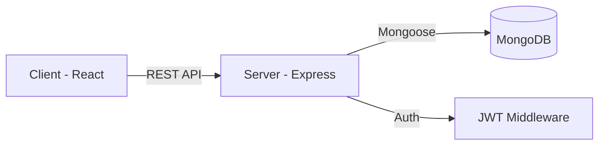

# Job Application Tracker Portal 🚀

An industry-standard MERN Stack project designed to help students and job seekers manage their job applications systematically. 

## 📖 Project Overview
The Job Application Tracker is a Full-Stack application allowing users to track their job hunt process. Job seekers can log applications, track current statuses (Applied, Interview, Offer, Rejected), manage interview dates, and view a consolidated dashboard.

## 🤔 Problem Statement
Job seekers often apply to dozens of companies weekly and lose track of the application status, interview schedules, and company names. Keeping track via spreadsheets is tedious. This project solves that by offering a centralized, easy-to-use, and dynamic portal to visualize the complete job hunt process.

## ✨ Features
- **User Authentication**: Secure Login & Registration using JWT & Bcrypt.
- **Dashboard**: A central hub to view all active applications.
- **Job CRUD**: Add, Update, View, and Delete job entries.
- **Status Tracking**: Filter applications by status (Applied, Interview, Offer, Rejected).
- **Responsive UI**: Built with Tailwind CSS for mobile and desktop screens.

## 🛠️ Tech Stack
- **Frontend**: React.js, Vite, Tailwind CSS, Axios, React Router Dom
- **Backend**: Node.js, Express.js
- **Database**: MongoDB, Mongoose
- **Authentication**: JSON Web Tokens (JWT)

## 🏗️ Architecture



## 📂 Folder Structure
```
Job-Application-Tracker-Portal/
│
├── client/                 # Frontend React Application
│   ├── src/
│   │   ├── components/     # Reusable UI components
│   │   ├── pages/          # Full page views (Login, Dashboard)
│   │   ├── App.jsx         # Main router
│   │   └── index.css       # Tailwind entry
│   └── package.json
│
├── server/                 # Backend Express Application
│   ├── models/             # Mongoose schemas (User, Job)
│   ├── routes/             # API route definitions
│   ├── controllers/        # Request handling logic
│   ├── middleware/         # Custom middleware (Auth)
│   ├── server.js           # Server entry point
│   └── package.json
│
└── README.md
```

## 🔌 API Endpoints
| Method | Endpoint | Description | Auth Required |
| --- | --- | --- | --- |
| POST | `/api/auth/register` | Register a new user | No |
| POST | `/api/auth/login` | Login user & get token | No |
| GET | `/api/jobs` | Get user's job applications | Yes |
| POST | `/api/jobs` | Add a new job application | Yes |
| PUT | `/api/jobs/:id` | Update job status | Yes |
| DELETE | `/api/jobs/:id` | Delete a job application | Yes |

## 🚀 How to Run Locally

### 1. Database Setup
Ensure you have MongoDB installed locally or a MongoDB Atlas URI.

### 2. Backend Setup
```bash
cd server
npm install
# Create a .env file based on .env.example
npm run dev
```

### 3. Frontend Setup
```bash
cd client
npm install
npm run dev
```
The frontend will run on `http://localhost:5173` and backend on `http://localhost:5000`.

## 🎓 Learning Outcomes
By building this project, you demonstrate:
- Full Stack API integration
- Secure Authentication flows
- State management in React
- Relational data modeling in NoSQL
- Modern UI/UX development with Tailwind

---
*Built as a Full Stack Development Portfolio Project.*
